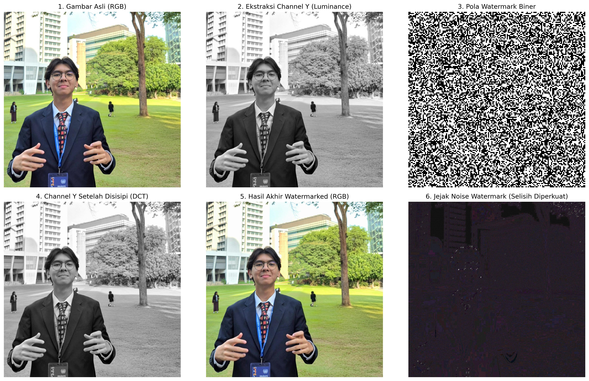

## Hasil Evaluasi Kompresi JPEG

Script secara otomatis menguji ketahanan (*robustness*) watermark terhadap serangan kompresi *lossy* JPEG dengan berbagai tingkat *Quality Factor* (QF). Kinerja diukur menggunakan **Bit Error Rate (BER)**. Jika nilai BER mendekati 0.5 (50%), watermark dianggap rusak total atau hancur karena data yang diekstrak murni berupa *noise* acak.

Berikut adalah hasil evaluasi ekstraksi watermark menggunakan metode DCT:

| Quality Factor (QF) JPEG | Bit Error Rate (BER) | Status Ekstraksi |
| --- | --- | --- |
| **100** | 0.0000 | Sempurna (100% terekstrak) |
| **95** | 0.0000 | Sempurna (100% terekstrak) |
| **90** | 0.0000 | Sempurna (100% terekstrak) |
| **80** | 0.0387 | Sangat Baik (Hanya 3,8% *error*) |
| **50** | 0.4976 | **Rusak Total (Hancur)** |
| **10** | 0.4980 | **Rusak Total (Hancur)** |

### Kesimpulan

Berdasarkan hasil pengujian di atas, metode penyisipan *watermark* pada frekuensi menengah menggunakan **DCT (Discrete Cosine Transform)** terbukti **sangat tangguh (*robust*)** terhadap serangan kompresi *lossy* JPEG.

*Watermark* mampu bertahan dengan tingkat *error* yang sangat minim (hanya 3,1%) pada tingkat kompresi standar (QF 80). Algoritma kompresi JPEG baru berhasil menghancurkan *watermark* (BER ~50%) ketika gambar dikompresi secara ekstrem pada **QF 50** ke bawah. Hal ini terjadi karena pada QF 50, algoritma kuantisasi JPEG mulai membuang informasi secara agresif, tidak hanya pada frekuensi tinggi, tetapi juga mulai mengeliminasi data pada pita frekuensi menengah tempat koefisien *watermark* disembunyikan.

## Visualisasi Transformasi (Step-by-Step)
Proses transformasi dari gambar RGB asli, ekstraksi *Luminance*, penyisipan, hingga pembuktian jejak *noise* divisualisasikan pada gambar berikut:

**Penjelasan 6 Tahap Transformasi:**
1. **Gambar Asli (RGB):** Foto *cover* asli (berwarna) sebelum mengalami proses modifikasi apapun.
2. **Ekstraksi Channel Y (Luminance):** Gambar dikonversi ke ruang warna YCbCr untuk memisahkan intensitas cahaya (hitam-putih) dari informasi warnanya. Penyisipan difokuskan di area ini agar warna asli gambar tidak berubah.
3. **Pola Watermark Biner:** Wujud visual dari deretan bit data rahasia acak (0 dan 1) yang disembunyikan ke dalam gambar.
4. **Channel Y Setelah Disisipi (DCT):** *Channel* luminance yang telah disisipi data *watermark* pada domain frekuensi menengah. Secara kasat mata, tidak terlihat adanya perbedaan dengan Panel 2.
5. **Hasil Akhir Watermarked (RGB):** *Channel* Y yang telah dimodifikasi (Panel 4) digabungkan kembali dengan *channel* warna aslinya (Cb dan Cr). Hasil akhirnya adalah gambar berwarna yang 100% terlihat sama persis dengan aslinya (*Imperceptible*).
6. **Jejak Noise Watermark:** Ini adalah selisih (pengurangan) piksel antara Gambar Asli dan Hasil Akhir yang intensitasnya diamplifikasi/diperkuat. Panel ini membuktikan secara matematis keberadaan modifikasi data yang tersebar merata dalam bentuk blok-blok DCT berukuran 8x8 piksel.
